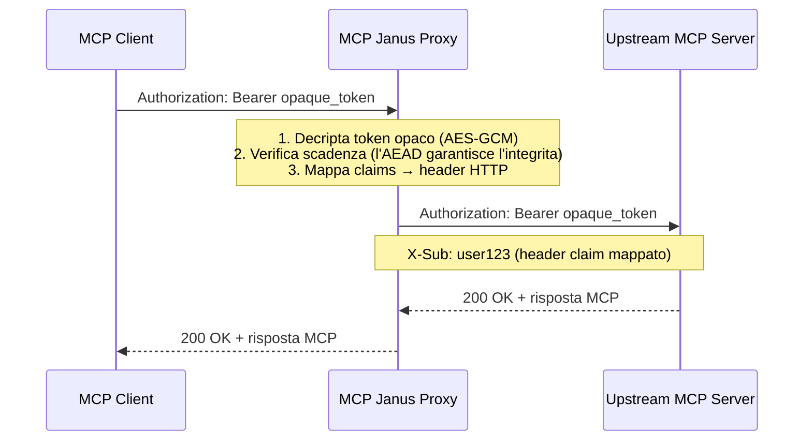

# MCP Janus

<p align="center">
  
</p>

<p align="center">
  <a href="README.md">English</a> · <b>Italiano</b>
</p>

<p align="center">
  <a href="https://golang.org"></a>
  <a href="LICENSE"></a>
  <a href="https://github.com/maurik77/mcp-janus/tags"></a>
  <a href="https://modelcontextprotocol.io/specification/2025-06-18/basic/authorization"></a>
  <a href="https://blog.modelcontextprotocol.io/posts/2026-07-28-release-candidate/"></a>
  <a href="https://datatracker.ietf.org/doc/html/draft-ietf-oauth-v2-1-13"></a>
  <a href="https://datatracker.ietf.org/doc/html/rfc7591"></a>
</p>

**Un proxy OAuth 2.1 che porta la sicurezza enterprise ai server MCP senza toccare una riga del codice del server.**

---

## Il Problema

La maggior parte dei proxy MCP risolve il problema dell'autenticazione nel modo sbagliato: ricevono il JWT reale dall'authorization server e lo consegnano direttamente al client MCP. Il client può ora decodificarlo, leggere ogni claim, riutilizzarlo contro l'IdP e scoprire i dettagli interni dell'identity provider — una violazione diretta della [specifica di autorizzazione MCP](https://modelcontextprotocol.io/specification/2025-06-18/basic/authorization), che proibisce esplicitamente l'inoltro di token non emessi per il proxy stesso.

Le conseguenze di sicurezza sono concrete:

- Il client apprende l'URL dell'IdP, il tenant, l'audience e i claim utente
- Un token rubato è riutilizzabile sia contro il proxy **che** contro l'IdP upstream
- Non esiste alcun confine tra "token per il proxy" e "token per tutto il resto"

## Cosa Fa Janus

Janus si posiziona davanti a qualsiasi server MCP ed esegue il flusso completo OAuth 2.1 + PKCE per conto dei client. Dopo lo scambio del codice di autorizzazione con il vero IdP, valida il JWT tramite il JWKS dell'IdP, **lo cripta con AES-256-GCM** e consegna al client un blob opaco. Ad ogni richiesta successiva decripta il token opaco, verifica la scadenza (l'AEAD garantisce l'integrità del contenuto — nessuna chiamata JWKS per richiesta), mappa i claim di identità negli header HTTP e inoltra la richiesta upstream.

**Il token IdP reale non lascia mai Janus — in nessuna direzione.** I client vedono solo testo cifrato; il server MCP upstream riceve l'identità autenticata come header HTTP puliti. Zero token passthrough, piena conformità alla specifica MCP.



<p align="center">
  
</p>

## Indice

- [A Chi È Rivolto](#a-chi-è-rivolto)
- [Funzionalità Principali](#funzionalità-principali)
- [Avvio Rapido](#avvio-rapido)
- [Come Funziona](#come-funziona)
- [Modello di Sicurezza](#modello-di-sicurezza)
- [Compatibilità](#compatibilità)
- [Configurazione](#configurazione)
- [Endpoint API](#endpoint-api)
- [Osservabilità](#osservabilità)
- [Docker](#docker)
- [Deployment](#deployment)
- [Roadmap](#roadmap)
- [Contribuire](#contribuire)
- [Riferimenti](#riferimenti)
- [Licenza](#licenza)

## A Chi È Rivolto

- **Platform engineer** che deployano server MCP in produzione e hanno bisogno di sicurezza reale
- **Team enterprise** che integrano Claude o ChatGPT con strumenti interni protetti da un IdP (Azure AD B2C, Okta, Keycloak, Auth0)
- **Sviluppatori di server MCP** che vogliono la conformità OAuth 2.1 senza reimplementare l'autenticazione da zero
- **Team di sicurezza** che verificano le integrazioni AI per perdite di token e conformità alle specifiche

---

## Funzionalità Principali

### Sicurezza

- **Token opachi crittografati** — AES-256-GCM (AEAD) avvolge ogni JWT dell'IdP; i client vedono solo testo cifrato
- **Nessun token passthrough** — il token IdP reale non raggiunge mai né il client né il server upstream; l'identità viaggia come header di claim mappati
- **Validazione JWT all'emissione** — validazione completa dei claim (scadenza, audience, issuer) con JWKS e rotazione automatica delle chiavi; l'integrità AEAD elimina le chiamate JWKS per ogni richiesta
- **Mappatura claims-to-headers** — iniezione configurabile dei claim IdP negli header HTTP upstream
- **Credenziali client crittografate** — la registrazione dinamica restituisce `client_id` / `client_secret` crittografati con AEAD
- **Modalità token self-issued** — Janus può emettere token propri a lunga durata (TTL configurabile) per client MCP come Claude e ChatGPT che non supportano il refresh
- **Fetch CIMD con protezione SSRF** — client ID URL solo HTTPS, rifiuto di IP privati/loopback, metodi di autenticazione simmetrici vietati

### Conformità agli Standard

- **OAuth 2.1 + PKCE** — flusso authorization code con code challenge S256; client pubblici (senza `client_secret`) completamente supportati
- **RFC 7591** — registrazione dinamica dei client con risposta completa §3.2.1
- **RFC 8414** — OAuth 2.0 Authorization Server Metadata (`/.well-known/oauth-authorization-server`)
- **RFC 9728** — metadata risorse protette con `bearer_methods_supported: ["header"]`
- **RFC 9207** — parametro `iss` nelle risposte di autorizzazione (protezione da AS mix-up)
- **RFC 8707** — resource indicator inoltrati attraverso i flussi di autorizzazione e token
- **RFC 7523** — autenticazione client `private_key_jwt` con protezione anti-replay sul `jti`
- **CIMD** — [Client ID Metadata Document](https://datatracker.ietf.org/doc/draft-ietf-oauth-client-id-metadata-document/): client ID basati su URL con fetch validato e cache — il pattern usato dai connettori ChatGPT
- **OpenID Connect Discovery** — `/.well-known/openid-configuration`

### Operatività

- **Stateless by design** — nessun database: registrazioni client, state OAuth e token sono blob autocontenuti cifrati con AEAD; scala orizzontalmente dietro qualsiasi load balancer
- **Singolo binario** — `go build` produce un unico binario statico, zero dipendenze runtime
- **OpenTelemetry** — tracing distribuito e metriche (Jaeger, Prometheus, Grafana pronti all'uso)
- **Docker Compose** — stack proxy + osservabilità completa con un solo comando
- **Logging strutturato** — log JSON, livello configurabile
- **Shutdown graduale** — drenaggio pulito delle connessioni su SIGTERM
- **Supporto CORS** — opt-in per client MCP browser (es. MCP Inspector)
- **Demo inclusa** — server MCP di test con una weather card interattiva basata su [MCP Apps](https://blog.modelcontextprotocol.io/posts/2026-07-28-release-candidate/)

---

## Avvio Rapido

### Opzione A — Test locale con Keycloak (consigliato per il primo avvio)

```bash
git clone https://github.com/maurik77/mcp-janus.git
cd mcp-janus

# Avvia Keycloak + server MCP di test
docker compose -f docker-compose.keycloak.yaml up -d

# Crea realm, client e utente di test — scrive .env.keycloak-dev
./scripts/keycloak/setup-keycloak.sh        # Linux/macOS
# .\scripts\keycloak\setup-keycloak.ps1     # Windows (PowerShell)

# Compila e avvia il proxy
task build
cp config.keycloak-dev.yaml config.yaml
source .env.keycloak-dev && CONFIG_PATH=. ./bin/mcpproxy

# Esegui il test end-to-end completo (apre il browser per il login)
./scripts/keycloak/test-proxy-flow.sh
```

Consulta [docs/guide_keycloak.md](docs/guide_keycloak.md) per la guida completa al setup Keycloak, incluse le istruzioni Windows (PowerShell).

### Opzione B — Usa il tuo IdP

```bash
git clone https://github.com/maurik77/mcp-janus.git
cd mcp-janus

go mod download
go build -o bin/mcpproxy ./cmd/proxy

# Modifica config.yaml con l'URL OIDC discovery del tuo IdP e le credenziali client
export MCP_IDP_CLIENT_SECRET="your-idp-client-secret"
CONFIG_PATH=. ./bin/mcpproxy
```

Oppure usa le scorciatoie [Task](https://taskfile.dev/):

```bash
task install   # go mod download + verify
task build     # compila → ./bin/mcpproxy
task run       # compila + avvia (richiede MCP_IDP_CLIENT_SECRET)
```

### Verifica che sia in esecuzione

```bash
curl http://localhost:8080/health
# OK

curl http://localhost:8080/.well-known/oauth-protected-resource | jq .
```

---

## Come Funziona

### Flusso token opachi standard

1. **Registrazione** — il client chiama `POST /register` con gli URI di redirect. Il proxy restituisce `client_id` e `client_secret` crittografati con AEAD (RFC 7591 §3.2.1). I client che pubblicano un [documento CIMD](https://datatracker.ietf.org/doc/draft-ietf-oauth-client-id-metadata-document/) possono saltare questo passo e usare il proprio URL HTTPS come `client_id`.
2. **Autorizzazione** — il client effettua il redirect a `GET /auth` con il `code_challenge` PKCE. Il proxy valida l'URI di redirect e reindirizza al vero IdP.
3. **Callback** — l'IdP reindirizza a `GET /callback`. Il proxy ri-valida l'URI di redirect, aggiunge il parametro `iss` (RFC 9207) e recapita il codice di autorizzazione al client.
4. **Scambio token** — il client chiama `POST /token` con il `code_verifier`. Il proxy scambia con l'IdP, valida il JWT tramite il JWKS dell'IdP, lo cripta con AES-256-GCM e restituisce un bearer opaco al client.
5. **Richieste autenticate** — il client invia `Authorization: Bearer <opaque>` a `/mcp/*`. Il proxy decripta il token opaco, verifica la scadenza (l'AEAD garantisce l'integrità del contenuto — nessuna chiamata JWKS), mappa i claim del JWT negli header HTTP e inoltra la richiesta upstream. Il token IdP decriptato non viene mai inoltrato.
6. **Refresh** — il client chiama `POST /refresh` con il refresh token crittografato. Il proxy decripta, effettua il refresh con l'IdP, ri-valida, ri-cripta e restituisce un nuovo bearer opaco.

### Modalità token self-issued (`token_behavior: self_issued`)

Alcuni client MCP (Claude, ChatGPT) completano il flusso OAuth una sola volta e non chiamano mai `/refresh`. Con la modalità predefinita `proxy`, le sessioni scadono alla scadenza del token dell'IdP (tipicamente 1 ora). La modalità `self_issued` risolve questo problema:

1. Dopo lo scambio iniziale con l'IdP, il JWT viene validato **una sola volta** e i claim vengono estratti.
2. Janus emette un token opaco proprio con i **claim mappati cifrati** e una scadenza controllata da Janus (`token_ttl`).
3. Ad ogni richiesta successiva il proxy decripta il token, verifica la scadenza e inietta i claim come header — **nessuna chiamata JWKS, nessun contatto con l'IdP**.
4. Se `/refresh` viene chiamato, viene emesso un nuovo access token dagli stessi claim cifrati fino al limite `token_max_ttl`, senza toccare l'IdP.

**Trade-off:**

| | `proxy` | `self_issued` |
| --- | --- | --- |
| Durata token | Controllata dall'IdP (es. 1 h) | Controllata da Janus (es. 720 h) |
| Revoca IdP efficace entro | ~1 h | fino a `token_max_ttl` |
| Freschezza dei claim | aggiornati al rinnovo del JWT IdP | congelati fino a `token_max_ttl` |
| Client senza refresh | sessione scade ogni ora | durata intera di `token_ttl` |

### Crittografia dei token

- **Algoritmo**: AES-256-GCM (AEAD — crittografia autenticata con dati associati)
- **Processo**: JWT reale → crittografia con chiave master a 256 bit → nonce casuale per operazione → codifica base64url → stringa opaca
- **Decrittografia**: estrazione bearer → decodifica base64url → decrittografia → parsing JWT → verifica scadenza

### Mappatura dei claim

I claim del JWT dell'IdP vengono mappati ad header HTTP ad ogni richiesta proxied:

```yaml
idp:
  claims_mapping:
    sub: X-Sub
    name: X-Full-Name
    email: X-Email
    upn: X-UPN
```

Il server MCP upstream riceve header HTTP puliti — nessun parsing JWT, nessuna dipendenza dall'IdP.

---

## Modello di Sicurezza

Janus applica tre confini di trust distinti:

| Confine | Cosa lo attraversa | Cosa non lo attraversa mai |
| --- | --- | --- |
| Client ↔ Janus | Bearer token opachi cifrati AEAD | Token IdP reali, dettagli interni dell'IdP, claim raw |
| Janus ↔ IdP | Scambio code OAuth 2.1, fetch JWKS, refresh grant | Segreti visibili al client |
| Janus ↔ Upstream | Bearer opaco + header di claim mappati (`X-Sub`, …) | Il JWT IdP decriptato |

Poiché il server upstream autentica le richieste fidandosi degli header iniettati da Janus, **l'upstream deve essere raggiungibile solo attraverso Janus** — da garantire con network policy, rete privata o mTLS tra proxy e upstream.

Regole fisse incorporate nel codice:

- I token viaggiano solo in header `Authorization: Bearer` — mai in query string
- Tutti gli endpoint OAuth richiedono HTTPS (eccezione localhost per lo sviluppo)
- Nessun token o segreto raw nei log ai livelli di log di produzione
- I client ID CIMD vengono recuperati con protezioni SSRF (solo HTTPS, niente IP privati/loopback) e non possono contenere segreti simmetrici

### Trade-off di design da conoscere

Il design completamente stateless (nessun database) ha conseguenze da pianificare:

- **Nessuna revoca anticipata** — un token opaco emesso resta valido fino alla scadenza; dimensiona `token_ttl` in base al tuo threat model
- **La rotazione della master key è globale** — ruotare `encryption.master_key` invalida in un colpo solo tutti i token e le registrazioni client in circolazione
- **Cache per-istanza** — lo store anti-replay per `private_key_jwt` e la cache CIMD sono in-memory; in deployment multi-replica la protezione anti-replay è limitata alla singola istanza

### Segnalare una vulnerabilità

Segnala le vulnerabilità sospette in privato tramite le [GitHub Security Advisories](https://github.com/maurik77/mcp-janus/security/advisories) invece di aprire una issue pubblica.

---

## Compatibilità

**Versioni del protocollo MCP.** Janus fa da proxy al traffico MCP a livello di trasporto HTTP/JSON-RPC ed è trasparente rispetto alla revisione di protocollo parlata tra client e server. Il flusso completo è verificato su streamable HTTP sia con il protocollo a sessione (`2025-06-18` / `2025-11-25`) sia con la [release candidate 2026-07-28](https://blog.modelcontextprotocol.io/posts/2026-07-28-release-candidate/) stateless — il server di test incluso gira sul Go SDK ufficiale con supporto dual-protocol.

**Client MCP.** Testato con Claude (Desktop e Code), connettori ChatGPT (flusso CIMD + `private_key_jwt`) e MCP Inspector (abilitare CORS).

**Identity provider.** Qualsiasi IdP conforme a OIDC che esponga i metadata di discovery e un endpoint JWKS. È incluso un ambiente Keycloak pronto all'uso; Azure AD B2C, Okta e Auth0 seguono lo stesso pattern di configurazione.

---

## Configurazione

Crea `config.yaml` nella directory di lavoro (oppure usa variabili d'ambiente con prefisso `MCP_`):

```yaml
proxy:
  base_url: http://localhost:8080        # URL canonico di questo proxy
  listen_addr: ":8080"
  log_level: info                        # trace|debug|info|warn|error
  log_format: json
  cors:
    enabled: false                       # true per client browser (es. MCP Inspector)
    allowed_origins:
      - http://localhost:6274
  token_behavior: proxy                  # proxy (default) | self_issued
  token_ttl: 24h                         # [self_issued] durata di ogni access token
  token_max_ttl: 168h                    # [self_issued] finestra massima dal login originale
  cimd_enabled: false                    # abilita client ID basati su URL (CIMD)

idp:
  client_id: your-idp-client-id
  client_secret: ""                      # usa env var MCP_IDP_CLIENT_SECRET
  openid_configuration_url: https://auth.example.com/.well-known/openid-configuration
  scopes:
    - openid
    - profile
    - email
  claims_mapping:
    sub: X-Sub
    name: X-Full-Name
    email: X-Email
  jwt_leeway: 10s

encryption:
  # Genera con: openssl rand -hex 32
  master_key: "your-64-char-hex-key"

upstream:
  name: my-mcp-server
  resource: https://mcp.example.com     # resource indicator per l'audience binding
  base_url: https://mcp.example.com
  path_prefix: /mcp

telemetry:
  enabled: true
  service_name: mcp-proxy
  otlp_endpoint: localhost:4318
```

Override tramite variabili d'ambiente:

```bash
export MCP_IDP_CLIENT_SECRET="your-secret"
export MCP_PROXY_BASE_URL="https://proxy.example.com"
export MCP_ENCRYPTION_MASTER_KEY="$(openssl rand -hex 32)"
export MCP_PROXY_CORS_ENABLED=true
export MCP_TOKEN_BEHAVIOR=self_issued
export MCP_TOKEN_TTL=720h
```

Consulta [.env.example](.env.example) per la lista completa.

---

## Endpoint API

| Metodo | Percorso | Descrizione |
|--------|----------|-------------|
| `GET` | `/.well-known/openid-configuration` | Discovery OpenID Connect |
| `GET` | `/.well-known/oauth-authorization-server` | Metadata authorization server (RFC 8414) |
| `GET` | `/.well-known/oauth-protected-resource` | Metadata risorsa protetta (RFC 9728) |
| `POST` | `/register` | Registrazione dinamica client (RFC 7591) |
| `GET` | `/auth` | Autorizzazione OAuth con PKCE |
| `GET` | `/callback` | Callback OAuth dall'IdP |
| `POST` | `/token` | Authorization code → bearer opaco |
| `POST` | `/refresh` | Scambio refresh token |
| `GET/POST` | `/mcp/*` | Proxy MCP autenticato |
| `GET` | `/health` | Health check |

### Esempio: registrare un client

```bash
curl -s -X POST http://localhost:8080/register \
  -H "Content-Type: application/json" \
  -d '{
    "client_name": "My MCP Client",
    "redirect_uris": ["http://localhost:3000/callback"],
    "grant_types": ["authorization_code", "refresh_token"],
    "response_types": ["code"]
  }' | jq .
```

Consulta [docs/testing-guide.md](docs/testing-guide.md) per la sequenza completa.

---

## Osservabilità

```bash
docker compose -f docker-compose.observability.yaml up -d
```

Avvia Jaeger (trace), Prometheus (metriche), Grafana (dashboard) e l'OpenTelemetry Collector. Il proxy esporta automaticamente quando `telemetry.enabled: true`.

Metriche principali:

| Metrica | Descrizione |
|---------|-------------|
| `mcp.proxy.auth.requests.total` | Richieste di autenticazione per risultato |
| `mcp.proxy.token.exchange.duration` | Latenza scambio token |
| `mcp.proxy.requests.total` | Richieste proxy per metodo/percorso/stato |
| `mcp.proxy.upstream.errors.total` | Contatore errori upstream |

Consulta [docs/opentelemetry.md](docs/opentelemetry.md) per il setup delle dashboard.

---

## Docker

```bash
# Proxy + server MCP di test
docker compose up -d

# Stack completo di osservabilità
docker compose -f docker-compose.observability.yaml up -d

# Entrambi insieme
docker compose -f docker-compose.yaml -f docker-compose.observability.yaml up -d

# Ambiente dev Keycloak
docker compose -f docker-compose.keycloak.yaml up -d
```

---

## Deployment

Lo script `deploy.sh` compila, etichetta, pubblica e deploya via Helm in un unico passaggio:

```bash
export REGISTRY=myregistry.azurecr.io
./deploy.sh 1.0.0
```

Passi eseguiti: `docker build` → tag + push al registry → aggiornamento `deployment/values-dev.yaml` → `helm upgrade`.

---

## Roadmap

- [ ] **Allineamento alla spec MCP 2026-07-28 finale** — SEP di hardening dell'autorizzazione (`application_type` in registrazione, credenziali legate all'issuer) man mano che la spec si finalizza
- [ ] **Refresh grant standard** — `grant_type=refresh_token` sull'endpoint `/token` accanto all'attuale `/refresh`
- [ ] **Revoca token e versioning delle chiavi** — endpoint RFC 7009 e rotazione della master key senza invalidare tutti i token in circolazione
- [ ] **Pipeline CI** — build, test, lint, `gosec` e `govulncheck` su ogni pull request

Hai un caso d'uso non coperto? [Apri una issue](https://github.com/maurik77/mcp-janus/issues) — le discussioni di design sono benvenute.

---

## Contribuire

1. Effettua il fork del repository e crea un branch per la funzionalità
2. Esegui `task fmt` prima del commit
3. Aggiungi test per le nuove funzionalità (table-driven preferiti)
4. Assicurati che `task build`, `task test` e `task lint` passino
5. Esegui `task security` (gosec) se hai toccato codice di auth, token o crittografia
6. Apri una pull request con una descrizione chiara

Per testare con un IdP reale, la [guida setup Keycloak](docs/guide_keycloak.md) ti fornisce un IdP locale in meno di 5 minuti.

---

## Riferimenti

### Specifiche MCP

- [MCP Authorization (2025-06-18)](https://modelcontextprotocol.io/specification/2025-06-18/basic/authorization)
- [MCP Security Best Practices](https://modelcontextprotocol.io/specification/2025-06-18/basic/security_best_practices)
- [MCP 2026-07-28 Release Candidate](https://blog.modelcontextprotocol.io/posts/2026-07-28-release-candidate/)

### Standard OAuth

- [OAuth 2.1 (IETF Draft)](https://datatracker.ietf.org/doc/html/draft-ietf-oauth-v2-1-13)
- [RFC 7523: JWT Client Authentication](https://datatracker.ietf.org/doc/html/rfc7523)
- [RFC 7591: Dynamic Client Registration](https://datatracker.ietf.org/doc/html/rfc7591)
- [RFC 8414: Authorization Server Metadata](https://datatracker.ietf.org/doc/html/rfc8414)
- [RFC 8707: Resource Indicators](https://datatracker.ietf.org/doc/html/rfc8707)
- [RFC 9207: AS Issuer Identification](https://datatracker.ietf.org/doc/html/rfc9207)
- [RFC 9728: Protected Resource Metadata](https://datatracker.ietf.org/doc/html/rfc9728)
- [Client ID Metadata Document (IETF Draft)](https://datatracker.ietf.org/doc/draft-ietf-oauth-client-id-metadata-document/)

### Documentazione del Progetto

- [Architettura e Design](docs/design.md)
- [Diagrammi del Flusso Auth](docs/auth-flow.md)
- [Guida Setup Keycloak](docs/guide_keycloak.md)
- [Guida ai Test](docs/testing-guide.md)
- [Setup OpenTelemetry](docs/opentelemetry.md)
- [Note sulla Specifica Auth MCP](docs/mcp-auth-notes.md)

---

## Licenza

MCP Janus è rilasciato sotto [licenza MIT](LICENSE).

Se Janus ti è utile, considera di lasciare una ⭐ al repository — aiuta gli altri a trovarlo.
