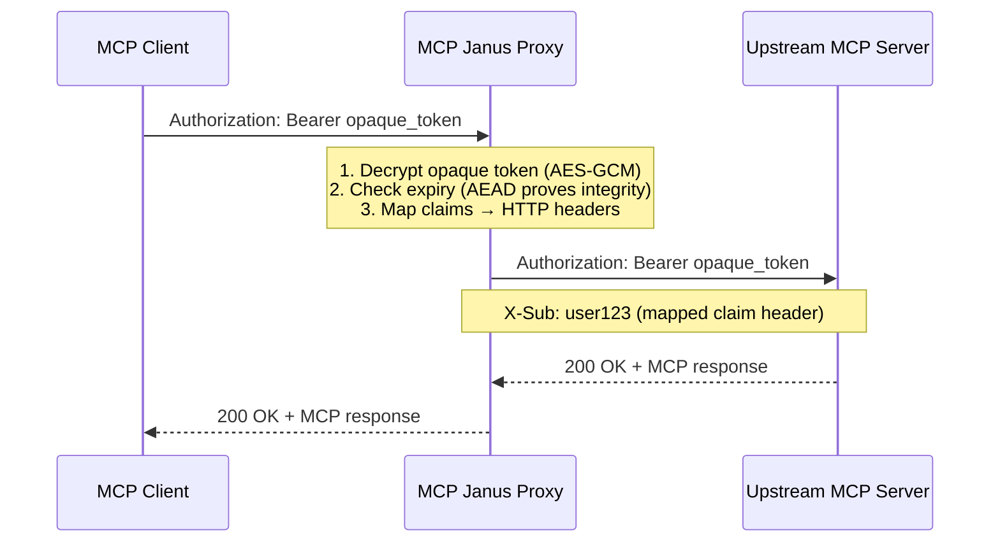
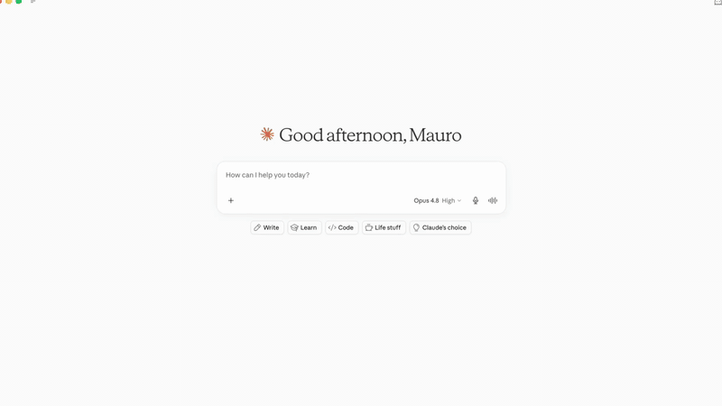

# MCP Janus

<p align="center">
  
</p>

<p align="center">
  <b>English</b> · <a href="README.ita.md">Italiano</a>
</p>

<p align="center">
  <a href="https://golang.org"></a>
  <a href="LICENSE"></a>
  <a href="https://github.com/maurik77/mcp-janus/tags"></a>
  <a href="https://modelcontextprotocol.io/specification/2025-06-18/basic/authorization"></a>
  <a href="https://blog.modelcontextprotocol.io/posts/2026-07-28-release-candidate/"></a>
  <a href="https://datatracker.ietf.org/doc/html/draft-ietf-oauth-v2-1-13"></a>
  <a href="https://datatracker.ietf.org/doc/html/rfc7591"></a>
</p>

**An OAuth 2.1 proxy that gives MCP servers enterprise-grade security without touching a line of server code.**

---

## The Problem

Most MCP proxies solve the auth problem the wrong way: they receive the real IdP JWT from the authorization server and hand it straight to the MCP client. The client can now decode that JWT, read every claim, replay it against the IdP, and discover your identity provider's internals — a direct violation of the [MCP authorization spec](https://modelcontextprotocol.io/specification/2025-06-18/basic/authorization), which explicitly forbids forwarding tokens not issued for the proxy itself.

The security impact is real:

- The client learns your IdP URL, tenant, audience, and user claims
- A stolen token is reusable against both the proxy **and** the upstream IdP
- There is no boundary between "token for the proxy" and "token for everything else"

## What Janus Does

Janus sits in front of any MCP server and runs the complete OAuth 2.1 + PKCE flow on behalf of clients. After exchanging an authorization code with the real IdP, it validates the JWT against the IdP's JWKS, **encrypts it with AES-256-GCM**, and gives the client an opaque blob instead. On every subsequent request it decrypts the opaque token, checks expiry (AEAD guarantees content integrity — no per-request JWKS call), maps the identity claims to HTTP headers, and forwards the request upstream.

**The real IdP token never leaves Janus — in either direction.** Clients only ever see ciphertext; the upstream MCP server receives the authenticated identity as clean HTTP headers. Zero token passthrough, full MCP spec compliance.



<p align="center">
  
</p>

## Table of Contents

- [Who Is This For?](#who-is-this-for)
- [Key Features](#key-features)
- [Quick Start](#quick-start)
- [How It Works](#how-it-works)
- [Security Model](#security-model)
- [Compatibility](#compatibility)
- [Configuration](#configuration)
- [API Endpoints](#api-endpoints)
- [Observability](#observability)
- [Docker](#docker)
- [Deployment](#deployment)
- [Roadmap](#roadmap)
- [Contributing](#contributing)
- [References](#references)
- [License](#license)

## Who Is This For?

- **Platform engineers** deploying MCP servers in production who need real security, not duct-tape auth
- **Enterprise teams** integrating Claude or ChatGPT with internal tools behind an IdP (Azure AD B2C, Okta, Keycloak, Auth0)
- **MCP server developers** who want OAuth 2.1 compliance without reimplementing auth from scratch
- **Security teams** auditing AI integrations for token leakage and spec compliance

---

## Key Features

### Security

- **Opaque encrypted tokens** — AES-256-GCM (AEAD) wraps every IdP JWT; clients only ever see ciphertext
- **No token passthrough** — the real IdP token never reaches the client or the upstream server; identity travels as mapped claim headers
- **JWT validation at issuance** — full claim validation (expiry, audience, issuer) with JWKS key fetching and automatic key rotation; AEAD integrity eliminates per-request JWKS calls
- **Claims-to-headers mapping** — configurable IdP claim injection into upstream HTTP headers
- **Encrypted client credentials** — dynamic registration returns AEAD-encrypted `client_id` / `client_secret`
- **Self-issued token mode** — Janus can issue its own long-lived tokens (configurable TTL) for MCP clients like Claude and ChatGPT that do not support token refresh
- **SSRF-guarded CIMD fetching** — HTTPS-only URL client IDs, private/loopback IP rejection, forbidden symmetric auth methods

### Standards Compliance

- **OAuth 2.1 + PKCE** — authorization code flow with S256 code challenge; public clients (no `client_secret`) fully supported
- **RFC 7591** — dynamic client registration with complete §3.2.1 response
- **RFC 8414** — OAuth 2.0 Authorization Server Metadata (`/.well-known/oauth-authorization-server`)
- **RFC 9728** — protected resource metadata including `bearer_methods_supported: ["header"]`
- **RFC 9207** — `iss` parameter in authorization responses (AS mix-up protection)
- **RFC 8707** — resource indicators forwarded through the authorization and token flows
- **RFC 7523** — `private_key_jwt` client authentication with `jti` replay protection
- **CIMD** — [Client ID Metadata Documents](https://datatracker.ietf.org/doc/draft-ietf-oauth-client-id-metadata-document/): URL-based client IDs with cached, validated document fetching — the pattern used by ChatGPT connectors
- **OpenID Connect Discovery** — `/.well-known/openid-configuration`

### Operations

- **Stateless by design** — no database: client registrations, OAuth state, and tokens are self-contained AEAD-encrypted blobs; scale horizontally behind any load balancer
- **Single binary** — `go build` produces one static binary, zero runtime dependencies
- **OpenTelemetry** — distributed tracing and metrics (Jaeger, Prometheus, Grafana out of the box)
- **Docker Compose** — one-command proxy + full observability stack
- **Structured logging** — JSON logs, configurable level
- **Graceful shutdown** — clean connection draining on SIGTERM
- **CORS support** — opt-in for browser-based MCP clients (e.g. MCP Inspector)
- **Batteries-included demo** — bundled MCP test server with an interactive [MCP Apps](https://blog.modelcontextprotocol.io/posts/2026-07-28-release-candidate/) weather card

---

## Quick Start

### Option A — Local testing with Keycloak (recommended for first run)

```bash
git clone https://github.com/maurik77/mcp-janus.git
cd mcp-janus

# Start Keycloak + MCP test server
docker compose -f docker-compose.keycloak.yaml up -d

# Bootstrap realm, client, and test user — writes .env.keycloak-dev
./scripts/keycloak/setup-keycloak.sh        # Linux/macOS
# .\scripts\keycloak\setup-keycloak.ps1     # Windows (PowerShell)

# Build and run the proxy
task build
cp config.keycloak-dev.yaml config.yaml
source .env.keycloak-dev && CONFIG_PATH=. ./bin/mcpproxy

# Run the full end-to-end test (opens browser for login)
./scripts/keycloak/test-proxy-flow.sh
```

See [docs/guide_keycloak.md](docs/guide_keycloak.md) for the complete Keycloak setup guide, including Windows (PowerShell) instructions.

### Option B — Bring your own IdP

```bash
git clone https://github.com/maurik77/mcp-janus.git
cd mcp-janus

go mod download
go build -o bin/mcpproxy ./cmd/proxy

# Edit config.yaml with your IdP's OIDC discovery URL and client credentials
export MCP_IDP_CLIENT_SECRET="your-idp-client-secret"
CONFIG_PATH=. ./bin/mcpproxy
```

Or use [Task](https://taskfile.dev/) shortcuts:

```bash
task install   # go mod download + verify
task build     # build → ./bin/mcpproxy
task run       # build + run (needs MCP_IDP_CLIENT_SECRET)
```

### Verify it's running

```bash
curl http://localhost:8080/health
# OK

curl http://localhost:8080/.well-known/oauth-protected-resource | jq .
```

---

## How It Works

### Standard opaque token flow

1. **Register** — client calls `POST /register` with redirect URIs. Proxy returns an AEAD-encrypted `client_id` and `client_secret` (RFC 7591 §3.2.1). Clients publishing a [CIMD document](https://datatracker.ietf.org/doc/draft-ietf-oauth-client-id-metadata-document/) can skip this step and use their HTTPS URL as `client_id`.
2. **Authorize** — client redirects to `GET /auth` with PKCE `code_challenge`. Proxy validates the redirect URI and redirects to the real IdP.
3. **Callback** — IdP redirects back to `GET /callback`. Proxy re-validates the redirect URI, appends the RFC 9207 `iss` parameter, and dispatches the authorization code to the client.
4. **Token exchange** — client calls `POST /token` with `code_verifier`. Proxy exchanges with the IdP, validates the JWT against the IdP's JWKS, encrypts it with AES-256-GCM, and returns an opaque bearer to the client.
5. **Authenticated requests** — client sends `Authorization: Bearer <opaque>` to `/mcp/*`. Proxy decrypts the opaque token, checks expiry (AEAD guarantees content integrity — no JWKS call needed), maps the JWT claims to HTTP headers, and forwards the request upstream. The decrypted IdP token is never forwarded.
6. **Refresh** — client calls `POST /refresh` with the encrypted refresh token. Proxy decrypts, refreshes with the IdP, re-validates, re-encrypts, and returns a new opaque bearer.

### Self-issued token mode (`token_behavior: self_issued`)

Some MCP clients (Claude, ChatGPT) complete the OAuth flow once and never call `/refresh`. With the default `proxy` mode, sessions expire when the IdP token expires (typically 1 hour). The `self_issued` mode solves this:

1. After the initial IdP exchange, the JWT is validated **once** and claims are extracted.
2. Janus issues its own opaque token containing the **encrypted mapped claims** and a Janus-controlled expiry (`token_ttl`).
3. On every subsequent request the proxy decrypts the token, checks the expiry, and injects the claims as headers — **no JWKS call, no IdP contact**.
4. If `/refresh` is called, a new access token is issued from the same encrypted claims up to `token_max_ttl` without touching the IdP.

**Trade-offs:**

| | `proxy` | `self_issued` |
| --- | --- | --- |
| Token lifetime | IdP-controlled (e.g. 1 h) | Janus-controlled (e.g. 720 h) |
| IdP revocation effective within | ~1 h | up to `token_max_ttl` |
| Claims freshness | refreshed at IdP token renewal | frozen until `token_max_ttl` |
| Clients without refresh support | session expires hourly | full `token_ttl` duration |

### Token encryption

- **Algorithm**: AES-256-GCM (AEAD — authenticated encryption with associated data)
- **Process**: real JWT → encrypt with 256-bit master key → random nonce per operation → base64url encode → opaque string
- **Decryption**: extract bearer → base64url decode → decrypt → parse JWT → validate expiry

### Claims mapping

IdP JWT claims are mapped to upstream HTTP headers on every proxied request:

```yaml
idp:
  claims_mapping:
    sub: X-Sub
    name: X-Full-Name
    email: X-Email
    upn: X-UPN
```

The upstream MCP server receives clean HTTP headers — no JWT parsing, no IdP dependency.

---

## Security Model

Janus enforces three distinct trust boundaries:

| Boundary | What crosses it | What never crosses it |
| --- | --- | --- |
| Client ↔ Janus | Opaque AEAD-encrypted bearer tokens | Real IdP tokens, IdP internals, raw claims |
| Janus ↔ IdP | OAuth 2.1 code exchange, JWKS fetches, refresh grants | Client-visible secrets |
| Janus ↔ Upstream | Opaque bearer + mapped claim headers (`X-Sub`, …) | The decrypted IdP JWT |

Because the upstream server authenticates requests by trusting the headers Janus injects, **the upstream must only be reachable through Janus** — enforce this with network policies, a private network, or mTLS between proxy and upstream.

Hard rules baked into the codebase:

- Tokens travel in `Authorization: Bearer` headers only — never in query strings
- All OAuth endpoints require HTTPS (localhost exception for development)
- No raw tokens or secrets in logs at production log levels
- CIMD client IDs are fetched with SSRF guards (HTTPS-only, no private/loopback IPs) and must not contain symmetric secrets

### Design trade-offs to know

The fully stateless design (no database) has consequences you should plan for:

- **No early revocation** — an issued opaque token stays valid until its expiry; choose `token_ttl` accordingly for your threat model
- **Master key rotation is global** — rotating `encryption.master_key` invalidates every outstanding token and client registration at once
- **Per-instance caches** — the `private_key_jwt` replay store and CIMD cache are in-memory; in multi-replica deployments replay protection is scoped to each instance

### Reporting a vulnerability

Please report suspected vulnerabilities privately via [GitHub Security Advisories](https://github.com/maurik77/mcp-janus/security/advisories) rather than opening a public issue.

---

## Compatibility

**MCP protocol versions.** Janus proxies MCP traffic at the HTTP/JSON-RPC transport level and is transparent to the protocol revision spoken between client and server. The full flow is verified against streamable HTTP with both the session-based protocol (`2025-06-18` / `2025-11-25`) and the stateless [2026-07-28 release candidate](https://blog.modelcontextprotocol.io/posts/2026-07-28-release-candidate/) — the bundled test server runs on the official Go SDK with dual-protocol support.

**MCP clients.** Tested with Claude (Desktop and Code), ChatGPT connectors (CIMD + `private_key_jwt` flow), and MCP Inspector (enable CORS).

**Identity providers.** Any OIDC-compliant IdP that exposes discovery metadata and a JWKS endpoint. A ready-to-run Keycloak environment is included; Azure AD B2C, Okta, and Auth0 follow the same configuration pattern.

---

## Configuration

Create `config.yaml` in the working directory (or use `MCP_`-prefixed environment variables):

```yaml
proxy:
  base_url: http://localhost:8080        # Canonical URL of this proxy
  listen_addr: ":8080"
  log_level: info                        # trace|debug|info|warn|error
  log_format: json
  cors:
    enabled: false                       # true for browser clients (e.g. MCP Inspector)
    allowed_origins:
      - http://localhost:6274
  token_behavior: proxy                  # proxy (default) | self_issued
  token_ttl: 24h                         # [self_issued] lifetime of each access token
  token_max_ttl: 168h                    # [self_issued] max window from original login
  cimd_enabled: false                    # allow URL-based client IDs (CIMD)

idp:
  client_id: your-idp-client-id
  client_secret: ""                      # use MCP_IDP_CLIENT_SECRET env var
  openid_configuration_url: https://auth.example.com/.well-known/openid-configuration
  scopes:
    - openid
    - profile
    - email
  claims_mapping:
    sub: X-Sub
    name: X-Full-Name
    email: X-Email
  jwt_leeway: 10s

encryption:
  # Generate with: openssl rand -hex 32
  master_key: "your-64-char-hex-key"

upstream:
  name: my-mcp-server
  resource: https://mcp.example.com     # resource indicator for audience binding
  base_url: https://mcp.example.com
  path_prefix: /mcp

telemetry:
  enabled: true
  service_name: mcp-proxy
  otlp_endpoint: localhost:4318
```

Environment variable overrides:

```bash
export MCP_IDP_CLIENT_SECRET="your-secret"
export MCP_PROXY_BASE_URL="https://proxy.example.com"
export MCP_ENCRYPTION_MASTER_KEY="$(openssl rand -hex 32)"
export MCP_PROXY_CORS_ENABLED=true
export MCP_TOKEN_BEHAVIOR=self_issued
export MCP_TOKEN_TTL=720h
```

See [.env.example](.env.example) for the full list.

---

## API Endpoints

| Method | Path | Description |
| ------ | ---- | ----------- |
| `GET` | `/.well-known/openid-configuration` | OpenID Connect discovery |
| `GET` | `/.well-known/oauth-authorization-server` | Authorization server metadata (RFC 8414) |
| `GET` | `/.well-known/oauth-protected-resource` | Protected resource metadata (RFC 9728) |
| `POST` | `/register` | Dynamic client registration (RFC 7591) |
| `GET` | `/auth` | OAuth authorization with PKCE |
| `GET` | `/callback` | OAuth callback from IdP |
| `POST` | `/token` | Authorization code → opaque bearer |
| `POST` | `/refresh` | Refresh token exchange |
| `GET/POST` | `/mcp/*` | Authenticated MCP proxy |
| `GET` | `/health` | Health check |

### Example: register a client

```bash
curl -s -X POST http://localhost:8080/register \
  -H "Content-Type: application/json" \
  -d '{
    "client_name": "My MCP Client",
    "redirect_uris": ["http://localhost:3000/callback"],
    "grant_types": ["authorization_code", "refresh_token"],
    "response_types": ["code"]
  }' | jq .
```

See [docs/testing-guide.md](docs/testing-guide.md) for the full curl sequence.

---

## Observability

```bash
docker compose -f docker-compose.observability.yaml up -d
```

Launches Jaeger (traces), Prometheus (metrics), Grafana (dashboards), and the OpenTelemetry Collector. The proxy exports automatically when `telemetry.enabled: true`.

Key metrics:

| Metric | Description |
| ------ | ----------- |
| `mcp.proxy.auth.requests.total` | Auth requests by result |
| `mcp.proxy.token.exchange.duration` | Token exchange latency |
| `mcp.proxy.requests.total` | Proxy requests by method/path/status |
| `mcp.proxy.upstream.errors.total` | Upstream error counter |

See [docs/opentelemetry.md](docs/opentelemetry.md) for dashboard setup.

---

## Docker

```bash
# Proxy + MCP test server
docker compose up -d

# Full observability stack
docker compose -f docker-compose.observability.yaml up -d

# Both together
docker compose -f docker-compose.yaml -f docker-compose.observability.yaml up -d

# Keycloak dev environment
docker compose -f docker-compose.keycloak.yaml up -d
```

---

## Deployment

The `deploy.sh` script builds, tags, pushes, and deploys via Helm in one step:

```bash
export REGISTRY=myregistry.azurecr.io
./deploy.sh 1.0.0
```

Steps performed: `docker build` → tag + push to registry → update `deployment/values-dev.yaml` → `helm upgrade`.

---

## Roadmap

- [ ] **MCP 2026-07-28 final spec alignment** — authorization hardening SEPs (`application_type` on registration, issuer-bound credentials) as the spec finalizes
- [ ] **Standard refresh grant** — `grant_type=refresh_token` on the `/token` endpoint alongside the current `/refresh`
- [ ] **Token revocation & key versioning** — RFC 7009 endpoint and rotating master keys without invalidating every outstanding token
- [ ] **CI pipeline** — build, test, lint, `gosec`, and `govulncheck` on every pull request

Have a use case that isn't covered? [Open an issue](https://github.com/maurik77/mcp-janus/issues) — design discussions are welcome.

---

## Contributing

1. Fork the repo and create a feature branch
2. Run `task fmt` before committing
3. Add tests for new functionality (table-driven preferred)
4. Ensure `task build`, `task test`, and `task lint` pass
5. Run `task security` (gosec) if you touched auth, token, or encryption code
6. Open a pull request with a clear description

If you're testing against a real IdP, the [Keycloak setup guide](docs/guide_keycloak.md) gives you a local IdP in under 5 minutes.

---

## References

### MCP Specifications

- [MCP Authorization (2025-06-18)](https://modelcontextprotocol.io/specification/2025-06-18/basic/authorization)
- [MCP Security Best Practices](https://modelcontextprotocol.io/specification/2025-06-18/basic/security_best_practices)
- [MCP 2026-07-28 Release Candidate](https://blog.modelcontextprotocol.io/posts/2026-07-28-release-candidate/)

### OAuth Standards

- [OAuth 2.1 (IETF Draft)](https://datatracker.ietf.org/doc/html/draft-ietf-oauth-v2-1-13)
- [RFC 7523: JWT Client Authentication](https://datatracker.ietf.org/doc/html/rfc7523)
- [RFC 7591: Dynamic Client Registration](https://datatracker.ietf.org/doc/html/rfc7591)
- [RFC 8414: Authorization Server Metadata](https://datatracker.ietf.org/doc/html/rfc8414)
- [RFC 8707: Resource Indicators](https://datatracker.ietf.org/doc/html/rfc8707)
- [RFC 9207: AS Issuer Identification](https://datatracker.ietf.org/doc/html/rfc9207)
- [RFC 9728: Protected Resource Metadata](https://datatracker.ietf.org/doc/html/rfc9728)
- [Client ID Metadata Documents (IETF Draft)](https://datatracker.ietf.org/doc/draft-ietf-oauth-client-id-metadata-document/)

### Project Documentation

- [Architecture & Design](docs/design.md)
- [Auth Flow Diagrams](docs/auth-flow.md)
- [Keycloak Dev Setup](docs/guide_keycloak.md)
- [Testing Guide](docs/testing-guide.md)
- [OpenTelemetry Setup](docs/opentelemetry.md)
- [MCP Auth Spec Notes](docs/mcp-auth-notes.md)

---

## License

MCP Janus is released under the [MIT License](LICENSE).

If Janus is useful to you, consider giving the repo a ⭐ — it helps others find it.
