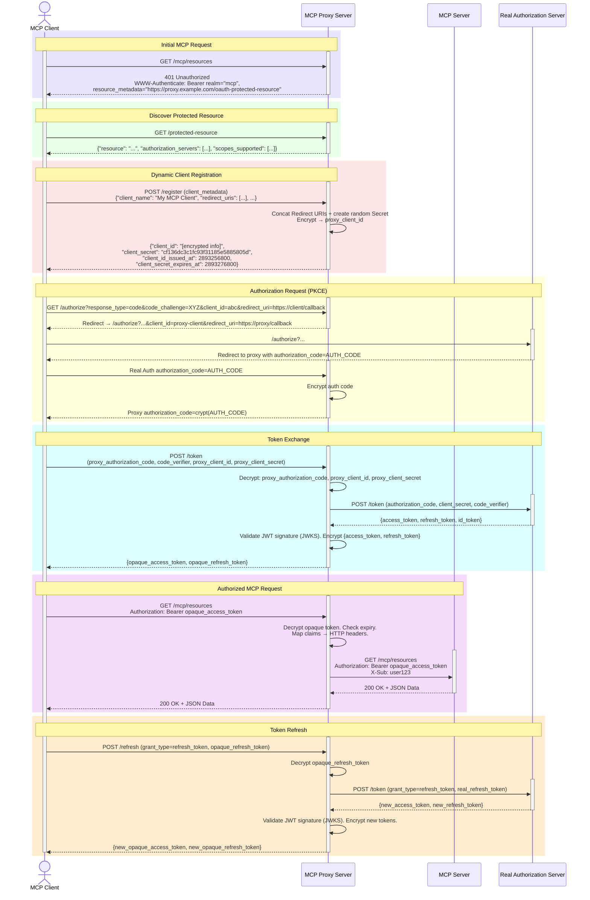

# MCP Proxy Server – Full Authorization and Communication Flow

```mermaid
sequenceDiagram
    actor Client as MCP Client
    participant Proxy as MCP Proxy Server
    participant MCP as MCP Server
    participant Auth as Real Authorization Server

    rect rgb(230, 230, 255)
        Note over Client,Proxy: Initial MCP Request
        activate Client
        activate Proxy
        Client->>Proxy: GET /mcp/resources
        Proxy-->>Client: 401 Unauthorized<br/>WWW-Authenticate: Bearer realm="mcp",<br/>resource_metadata="https://proxy.example.com/oauth-protected-resource"
        deactivate Proxy
    end

    rect rgb(230, 255, 230)
        Note over Client,Proxy: Discover Protected Resource
        activate Proxy
        Client->>Proxy: GET /protected-resource
        Proxy-->>Client: {"resource": "...", "authorization_servers": [...], "scopes_supported": [...]}
        deactivate Proxy
    end

    rect rgb(255, 230, 230)
        Note over Client,Proxy: Dynamic Client Registration
        activate Proxy
        Client->>Proxy: POST /register (client_metadata)<br/>{"client_name": "My MCP Client", "redirect_uris": [...], ...}
        Proxy->>Proxy: Concat Redirect URIs + create random Secret<br/>Encrypt → proxy_client_id
        Proxy-->>Client: {"client_id": "[encrypted info]",<br/>"client_secret": "cf136dc3c1fc93f31185e5885805d",<br/>"client_id_issued_at": 2893256800,<br/>"client_secret_expires_at": 2893276800}
        deactivate Proxy
    end

    rect rgb(255, 255, 220)
        Note over Client,Auth: Authorization Request (PKCE)
        activate Proxy
        Client->>Proxy: GET /authorize?response_type=code&code_challenge=XYZ&client_id=abc&redirect_uri=https://client/callback
        Proxy-->>Client: Redirect → /authorize?...&client_id=proxy-client&redirect_uri=https://proxy/callback
        deactivate Proxy
        activate Auth
        Client->>Auth: /authorize?...
        Auth-->>Client: Redirect to proxy with authorization_code=AUTH_CODE
        deactivate Auth
        activate Proxy
        Client->>Proxy: Real Auth authorization_code=AUTH_CODE
        Proxy->>Proxy: Encrypt auth code
        Proxy-->>Client: Proxy authorization_code=crypt(AUTH_CODE)
        deactivate Proxy
    end

    rect rgb(220, 255, 255)
        Note over Client,Auth: Token Exchange
        activate Proxy
        Client->>Proxy: POST /token<br/>(proxy_authorization_code, code_verifier, proxy_client_id, proxy_client_secret)
        Proxy->>Proxy: Decrypt: proxy_authorization_code, proxy_client_id, proxy_client_secret
        activate Auth
        Proxy->>Auth: POST /token (authorization_code, client_secret, code_verifier)
        Auth-->>Proxy: {access_token, refresh_token, id_token}
        deactivate Auth
        Proxy->>Proxy: Validate JWT signature (JWKS). Encrypt {access_token, refresh_token}
        Proxy-->>Client: {opaque_access_token, opaque_refresh_token}
        deactivate Proxy
    end

    rect rgb(245, 220, 255)
        Note over Client,MCP: Authorized MCP Request
        activate Proxy
        Client->>Proxy: GET /mcp/resources<br/>Authorization: Bearer opaque_access_token
        Proxy->>Proxy: Decrypt opaque token. Check expiry.<br/>Map claims → HTTP headers.
        activate MCP
        Proxy->>MCP: GET /mcp/resources<br/>Authorization: Bearer opaque_access_token<br/>X-Sub: user123
        MCP-->>Proxy: 200 OK + JSON Data
        deactivate MCP
        Proxy-->>Client: 200 OK + JSON Data
        deactivate Proxy
    end

    rect rgb(255, 235, 205)
        Note over Client,Auth: Token Refresh
        activate Proxy
        Client->>Proxy: POST /refresh (grant_type=refresh_token, opaque_refresh_token)
        Proxy->>Proxy: Decrypt opaque_refresh_token
        activate Auth
        Proxy->>Auth: POST /token (grant_type=refresh_token, real_refresh_token)
        Auth-->>Proxy: {new_access_token, new_refresh_token}
        deactivate Auth
        Proxy->>Proxy: Validate JWT signature (JWKS). Encrypt new tokens.
        Proxy-->>Client: {new_opaque_access_token, new_opaque_refresh_token}
        deactivate Proxy
        deactivate Client
    end
```
